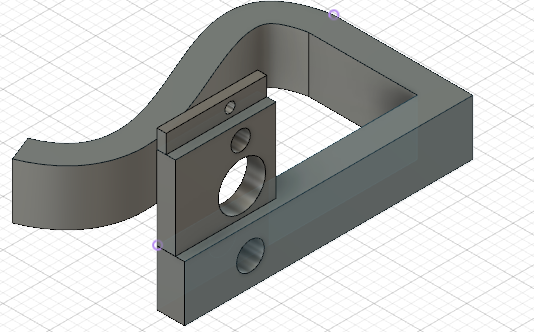
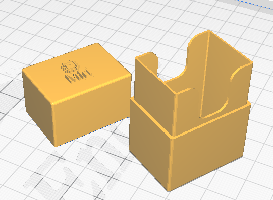
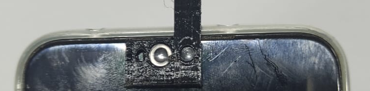
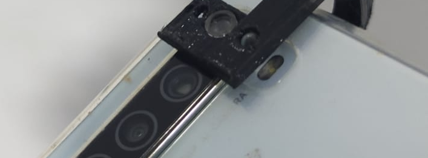

# Miri

## Lista de conteudo

1. [Objetivos](#objetivos)
2. [Equipamento](#equipamento)
3. [Modo de uso](#modo-de-uso)
4. [Melhorias](#melhorias)

 ---

## Objetivos

O objetivo desse equipamento é poder portar e carregar um microscópio com 4 tipos diferentes de aumentos; que possa ser carregado para vários lugares pela sua portabilidade (tamanho reduzido) e por ser acoplável a um telefone celular. Vem com uma case para proteger o equipamento.

---

## Equipamento

Todo o corpo do produto, tanto a parte que vai no celular quanto a caixa protetora foi projetada em software 3D e impressos em impressora 3D. Os arquivos de cada corpo estão nessa pasta.
As lentes são esferas de vidro ou plásticas transparentes, sem furos no meio e lisas, com diâmetros de: 1 mm, 2 mm, 3 mm e 5 mm. Uma pequena folha de acetato vai no conjunto para ser usada como lâmina, auxiliando a visualização de pequenos corpos em meio aquoso.
As lentes são simplesmente encaixadas nos seus respectivos furos. Para proteger o equipamento e carregá-lo, é incluso uma caixa também impressa em impressora 3D
Os parâmetros de impressão são:
* Preenchimento 10%;
* Altura de camada de 0.12mm e primeira camada com 0.28mm;
* Velocidade de impressão de 30 mm/s para parede e 50 mm/s para preenchimento.
* Velocidade de impressão da primeira camada de 10 mm/s;
O material utilizado no protótipo foi PETG, utilizando 14 g de material, com custo de material na impressora de R$ 1,68.

Imagem 1 – Modelo 3D do microscópio com os furos para as lentes

Imagem 2 – Modelo 3D da caixa protetora

---

## Modo de uso

O equipamento pode ser acoplado tanto na câmera frontal do celular como na câmera traseira.
Seu uso na câmera traseira é indicado para a lente de 5 mm, como mostrado na imagem 2.
Seu uso na câmera frontal é indicado para as lentes de menor diâmetro. Também é recomendado utilizar o acetato como lâmina como mostrado na imagem 3.

Imagem 3 – Instalação do microscópio na câmera frontal

Imagem 4 – Instalação do microscópio na câmera traseira

----

## Melhorias

Esse equipamento, futuramente para a ARA, poderia ser dado como brinde aos consultores que adquirirem futuros produtos caros. Então, quando chegar a hora, deve ser redimensionado para poder ter um tamanho universal.