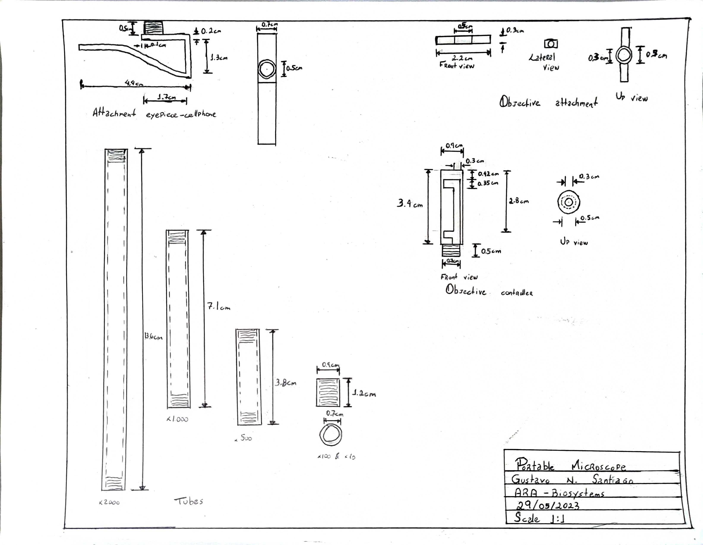

# Miri

## List of Contents

1. [Objective](#objective)
2. [Literature Review](#literature-review)
3. [Code for lenses calculation](#code-for-lenses-calculation)
    1. [Considerations (how I obtained the values used)](#considerations-how-i-obtained-the-values-used)
4. [Structure sketch](#structure-sketch)

---

## Objective

The objective of this project is to build a portable microscope to be attached in a cellphone. The images are seen using the phone's camera. Using spherical glass lenses, the microscope have the capacity to zoom in 10, 100, 500, 1000 and 2000 times.

---

## Literature Review

The inspiration of the design and how to calculate the distances of this microscope were from the commercial common optical microscopes. They work basically as shown in the image bellow:

An example of distances calculation, taking into account the magnification and focal length can be seen in this [document](./SupplementaryDocuments/Calculation%20Example.docx).

---

## Code for lenses calculation

To calculate the necessary distance between lens, and using the example provided in the section 2, were made a calculation in a paper, transferred to a [digital form](./SupplementaryDocuments/FormulaBuildings.docx).

Nonetheless, I wanted to check the best (or bests) radius of spheres observing the distance outputs. Mainly check if the distances were values not too big to put into practice, considering the desired magnifications. In the end, an [python algorithm](LensesCalculation.ipynb) were made, and had a [csv output](./SupplementaryDocuments/MiriParameters.csv) with the results of the distances, considering magnifications and sphere radius.

 

### Considerations (how I obtained the values used)
There are in the algorithm, values set for focal distance of the eyepiece and distance eyepiece-image. That's because I already had a lens from a laser toy to be used as the eyepiece, and I discovered the distance eyepiece-image I needed.
* To obtain the focal distance of the lens, I took a strong source of light(lighting) and inserted my lens between it and a bulkhead. When the light focused by the lens in the bulkhead was the smallest possible, I measured the distance lens-bulkhead. That is the focal distance.
* As this microscope will be used in a cellphone, and the eyepiece will be placed touching the camera, the distance eyepiece-image had to be the focusing distance of the cellphone camera. To find that, I measured the minimal distance which the cellphone camera could focus.
* Since I already had a spherical lens obtained from a spray structure, and it has a radius of 1.5cm, all the structure sizing was made taking this size into consideration.

---

## Structure sketch

As mentioned above, I already had a 1.5cm radius sphere. Using the results obtained from the code, I drew a sketch first in 2 dimensions in paper and then in a software. The distances used, and a image of the sketch can be seen bellow:

| Sphere radius	| Magnification	 | Distance eyepiece-object	| Distance objective-object | Distance objective-image	| Tube size |
| ---- | ---- | ---- | ---- | ---- | ---- |
1.5 | 10 | 2.2867513611615244 | 28.488888888888887 | 4.6533575317604345 | 6.940108892921959
1.5	|100|	2.2867513611615244|	6.448888888888889|	10.533575317604354|	12.820326678765879|
1.5|	500|	2.2867513611615244|	4.489777777777777|	36.66787658802177|	38.95462794918329|
1.5|	1000|	2.2867513611615244|	4.244888888888889|	69.33575317604357|	71.62250453720509|
1.5|	2000|	2.2867513611615244|	4.122444444444445|	134.6715063520871|	136.95825771324863|

